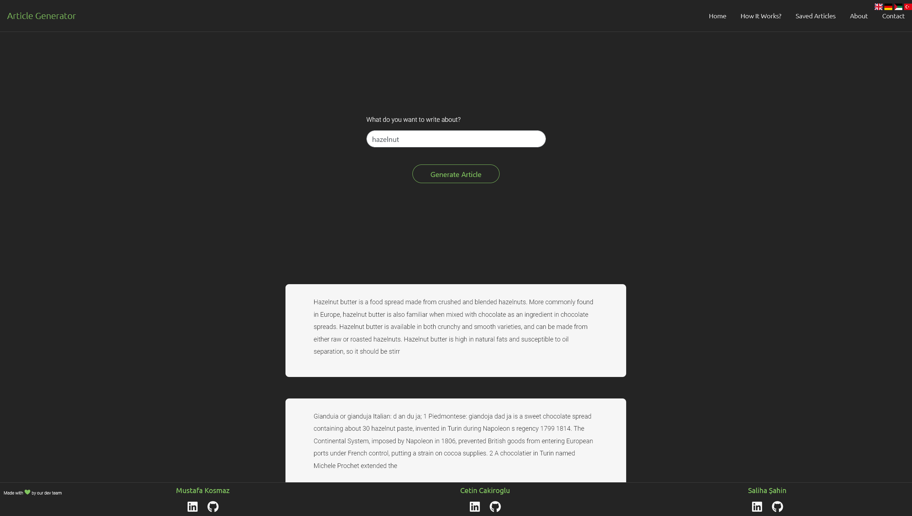

# Project: Article Generator

- Article Generator is a content maker, aims to bring relevant paragraphs by keyword input from the user.
- User can add, remove, edit, save, update or delete articles.
- This project is a result of 2 weeks of sprint period. Updates, improvements and refactoring will be applied in future sprints.

### Team Members
- Çetin Çakıroğlu / UX-frontend-backend / [linkedIn](https://www.linkedin.com/in/cakiroglu-cetin/) [Github](https://github.com/cetincakiroglu)
- Saliha Şahin / UI-frontend /[linkedIn](https://www.linkedin.com/in/saliha-%C5%9Fahin-45651a19a/) [Github](https://github.com/SalihaSahin)
- Mustafa Koşmaz / Backend /[linkedIn](https://www.linkedin.com/in/neverrun/) [Github](https://github.com/01mk027)
### Technologies Used
- React.js
- React Bootstrap
- Node.js
- Express.js
- Cheerio
- Google Custom Search API
- Heroku

### Task List

### Stage I // Design UI
- [x] Design project components in Figma.

### Stage II // Preparing the environment
- [x] Create React environment in local.
- [x] Install React Router & React Bootstrap.
- [x] Create component files and folders according to the design file.
- [x] Code basic outlines of project.
    1. [x] Landing page.
    2. [x] Article component.
    3. [x] Article card component.
    4. [x] How it works page.
    5. [x] Contact page.
    6. [x] About us page. 
    7. [x] Saved Articles component.
    
### Stage III // Fake data
- [x] Implement input field, user should be able to enter keywords.
- [x] Search the dummy data by keywords.
- [x] Find matching articles from the array of dummy articles.
- [x] Store matching article in an array by state and send it to Article Card component.
- [x] Map the article array and generate Article Card.
- [x] Implement a button to edit article.
    1. [x] Make a component to send article into a text area.
    2. [x] Add class toggler to buttons. Article Card should be hidden when user is editing.
    3. [x] Implement a save button, it should hide text area and show article card on click.
    4. [x] Update article card with edited article.
    5. [x] Transfer saved article to Saved Articles component.
    6. [x] Initialize the local storage and save updated article.
    

### Stage IV // Real data
- [x] Perform a search on Google by keywords with Google Custom Search API.
- [x] Build a node app to scrape websites.
- [x] Build an API to establish communication between Node app and frontend.
- [x] Display articles in frontend.

### Stage V // Revision
- [x] Complete static components.
    1. [x] How it works?
    2. [x] About us
    3. [x] Contact
- [x] Implement react router dom.
- [x] Refactor components, improve code quality.
- [x] Improve styling, make it more responsive.
- [x] Check cross-browser compatibility
- [ ] Deploy.

---

### Project Images

